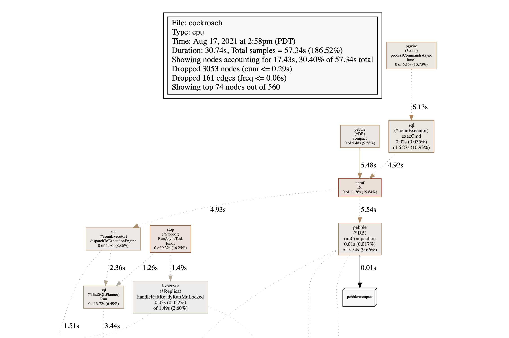

# Tracing CRDB with Golang tools


## Pulling PPROF

This is done via the restful interface.  Gather these endpoints
with `curl` and redirect to a file(s).

* `https://127.0.0.1:8080/debug/pprof/profile?seconds=15`
* `https://127.0.0.1:8080/debug/pprof/heap?seconds=15`
* `https://127.0.0.1:8080/debug/pprof/goroutine?debug=2`

* [pprof_pull](pprof_pull_roachprod.sh) tool for roachprod/insecure clusters throught driver machine with haproxy


## Displaying PPROF 

* `go tool pprof -tags <profile>`
* `go tool pprof -web <profile>`


### pprof -tags examples


#### Single pprof file

```bash
$ go tool pprof -tags ./cpu.pprof

 addr: Total 10.0ms
       10.0ms (  100%): internal

 appname: Total 10.0ms
          10.0ms (  100%): $ internal-update-session

 pebble: Total 1.8s
           1.6s (91.16%): compact
         90.0ms ( 4.97%): flush
         50.0ms ( 2.76%): wal-sync
         10.0ms ( 0.55%): gc
         10.0ms ( 0.55%): table-cache

 stmt.anonymized: Total 10.0ms
                  10.0ms (  100%): UPDATE sqlliveness SET expiration = $1 WHERE session_id = $2 RETURNING session_id

 stmt.tag: Total 10.0ms
           10.0ms (  100%): UPDATE

```

#### pprof tags ALL files together

Find ALL cpu.pprof files and show the distribution of CPU usage.  This example takes data
from multipe nodes in a cluster.

```bash
find . -name cpu.pprof -print0 | xargs -0 go tool pprof -tags

 addr: Total 7.9s
       170.0ms ( 2.15%): 10.4.14.228:54978
       170.0ms ( 2.15%): 10.4.94.112:37252
       160.0ms ( 2.02%): 10.4.89.209:35096
       150.0ms ( 1.90%): 10.4.64.133:49286
       140.0ms ( 1.77%): 10.4.64.133:37334
       120.0ms ( 1.52%): 10.4.64.133:48878
       120.0ms ( 1.52%): 10.4.85.55:50794
       110.0ms ( 1.39%): 10.4.14.239:45082
....
...
 appname: Total 40.0ms
          10.0ms (25.00%): $ internal-job-update
          10.0ms (25.00%): $ internal-log-job
          10.0ms (25.00%): $ internal-stmt-diag-poll
          10.0ms (25.00%): $ internal-update-session

 pebble: Total 5.1s
            4.4s (87.55%): compact
         460.0ms ( 9.09%): wal-sync
          90.0ms ( 1.78%): flush
          70.0ms ( 1.38%): gc
          10.0ms (  0.2%): table-cache

 stmt.anonymized: Total 7.9s
...
                   10.0ms ( 0.13%): UPDATE shipment SET delivery_status = $1, tracking_registration_status = $2, updated_on = $3 WHERE shipment.id = $4 RETURNING shipment.id, shipment.delivery_status, shipment.tracking_number, shipment.tracking_number_override, shipment.tracking_url, shipment.courier, shipment.checkpoints, shipment.expected_delivery_date, shipment.created_on, shipment.updated_on, shipment.cancelled_on, shipment.merchant_id, shipment.registration_ttl, shipment.tracking_id, shipment.platform_id, shipment.tracking_status_override, shipment.status, shipment.tracking_registration_status, shipment.gdpr_erased_dt, shipment.consumer_status
                   10.0ms ( 0.13%): UPDATE sqlliveness SET expiration = $1 WHERE session_id = $2 RETURNING session_id
                   10.0ms ( 0.13%): UPDATE system.jobs SET progress = $2 WHERE id = $1

 stmt.tag: Total 7.9s
              7.4s (93.55%): SELECT
           190.0ms ( 2.40%): UPDATE
           180.0ms ( 2.28%): RELEASE
           140.0ms ( 1.77%): INSERT
```

### pprof with visual WEB 

This brings up a browser to view on on various details in a flow diagram.

```bash
find . -name cpu.pprof -print0 | xargs -0 go tool pprof -web
```


